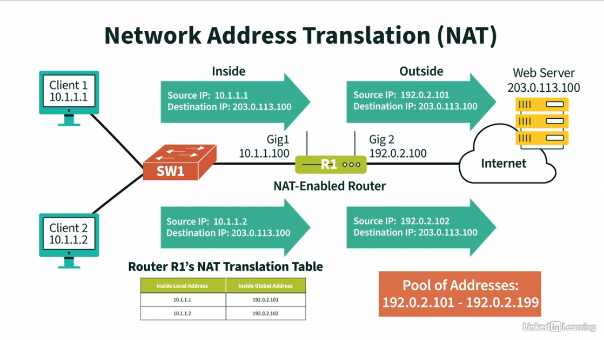
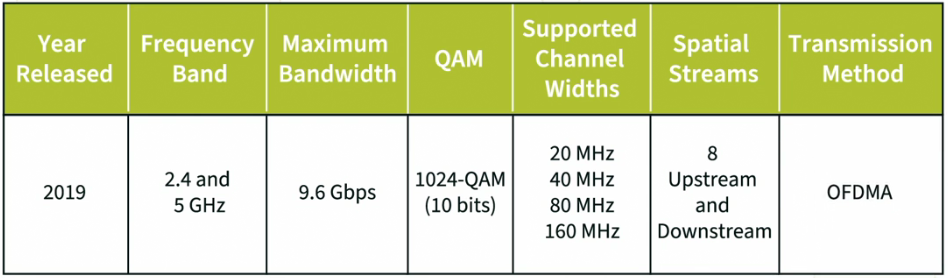

# Networking Foundations: Networking Basics

### The OSI Model
Also called Open Systems Interconnection (OSI) model, categories of networking components with different functions.

1. **Physical Layer** - data here is called **bits**. COPPER CABLES/NICS/HUBS operate here.
2. **Data Link Layer** - this layer is concerned with physical addressing (e.g. MAC address). The data here is called **frames**. ETHERNET operates here.
3. **Network Layer** - this layer is concerned with logical addressing (e.g. IP Address). The data here is called **packets**. ROUTERS operate here.
4. **Transport Layer** - this layer is concerned with logical connections. Remember how TCP/IP checks if the packet is reliable or unreliable? This is where TCP or UDP operates. The data here is called **segments**.
5. **Session Layer** - this layer is concerned with communications involving sessions between applications. Example of this is API sessions.
6. **Presentation Layer** - this layer is concerned with how data is represented; how data is encrypted using encryption protocols. Example of it is JPEG formatting.
7. **Application Layer** - this is the user interface. This is also where HTTP and HTTPs lives, as well as the DNS server!

**Mnemonic 1 (bottom-up approach)**: Please Do Not Throw Sausage Pizza Away
**Mnemonic 2 (top-bottom approach)**: All People Seem To Need Data Processing

#### Comparison with the TCP/IP Model
TCP/IP Model - this combines layers 5 to 7 of the OSI model.

1. **Network Access Layer** - combination of Physical and Data Link Layer
2. **Internet Layer** - Network Layer
3. **Transport Layer** - Transport Layer
4. **Application Layer** - combination of the session, presentation, and application layer of the OSI model.

Some variants of the TCP/IP has 5 layers, where Network Access Layer is broken down into two.

#### Protocols of the Application Layer
TCP gives us _reliable_ communication while UDP gives us _unreliable_ communication.

1. **HTTP** - Hypertext Transport Protocol; at TCP port `80`.
2. **HTTPS** - HTTP Secure; at TCP port `443`.
3. **DNS** - Domain Name System; at TCP or UDP port `53`.
4. **NTP** - Network Time Protocol; at UDP port `123`.
5. **DHCP** - Dynamic Host Configuration Protocol; at UDP port `67`.

### Network Services

**DHCP or the Dynamic Host Configuration Protocol**
DHCP is a network protocol that automatically assigns IP addresses and other network configuration settings to devices on a network.

- **DORA** acronym - *Discover*, *Offer*, *Request*, and *Acknowledgement*
- The **Discover** is the name of the broadcast that the PC is asking if there is any DHCP server in the subnet.
- The **Offer** tells the PC the IP address of the DHCP server, if there is any.
- The **Request** asks the DHCP server for the IPv4 address. The client selects one of the DHCP Offer messages and broadcasts a DHCP Request message to the network.
- The **Acknowledgement** is the DHCP server responding to that request.

*DHCP* simplifies network management by automating IP address assignment.
*DORA* is the four-step process that DHCP uses to assign IP addresses.

**Stateless vs Stateful DHCP Server**

**Stateless DHCPv6 Server**:

Address Assignment: Does not directly assign IPv6 addresses to clients.

Autoconfiguration: Hosts generate their own IPv6 addresses based on the network prefix advertised by router

**Stateful DHCPv6 Server**:

Address Assignment: Assigns IPv6 addresses to clients directly, much like traditional DHCP for IPv4.

Autoconfiguration: Not involved in autoconfiguration.

**DNS** - Domain Name System
**DNS** translates the easy-to-remember names to the actual IP address and returns it to the client.

**NAT** - Network Address Translation
**NAT** allows the client to have one set of IP addresses inside of their network and have those IP addresses translated into one or more IP addresses that can be found on the internet.

For IPv4, there are IP addresses designed to be private. NAT takes that private address and translate it to publicly ratable IP address should the client sends request to the outside world.

**PAT** - Port Address Translation
Allows the client to have multiple IP addresses shared inside a global address.

NTP - Network Time Protocol
NTP keeps the devices times in sync.
NTP uses port **UDP 123**.

Stratum Number - believability of a time source.
For instance, an atomic clock has a stratum number of 0. Meanwhile, an internet-based NTP server has a stratum of 1.

This means that the *farther* you are from the atomic clock, the *less accurate* your time source is.

**QoS** - Quality of Service
**QoS** helps with bandwidth congestion or traffic.
For instance, a switch rated 1Gbps sending a packet to a router that can only send out 100Mbps to the internet will cause bottlenecks.

**QoS Features**
1. Classification and Marking - like in boarding passes, one feature of QoS is classifying traffic early on its travel then mark it with priority marking.
2. Queueing - the router allocates memory called bucket or queue to store that incoming traffic. This stores packets that cannot be sent at the moment.

### Wireless Networks

**Ad Hoc Wireless LAN** does not need network infrastructure. It is also convenient for file transfers. It typically uses Bluetooth or Wi-Fi for connections. An instance of this is AirDrop or ShareIt.

**Infrastracture Wireless LAN** in this LAN, wireless clients connect to **access points**. **Access points** then connect to wired infrastructure. It is **scalable** by adding more access points when necessary. Finally, it supports management and monitoring features not available with ad hoc wireless networks.

**Mesh Wireless LAN** in this LAN, mesh access points need not be connected with a wired infrastructure. Mesh access points receive and retransmit a wireless signal -- this allows flexibility in access point placement.

|**Mesh** refers to the interconnected nature of the nodes. They don't just broadcast their own signal; they also talk to each other, sharing the load and ensuring data efficiently reaches its destination. **Mesh networks** are self-healing, meaning if one access point fails or is obstructed, the others can still communicate and maintain network connectivity.

**2.4 GHz Channels**
* 5 MHz between channels
* Exception: 12MHz between channels 13 and 14
* Channel 14 only allowed in Japan

Wireless Network Antenna Types
1. **Omnidirectional Antenna.** Also called dipole antenna, this transmits in all directions perpendicular to the antenna. Multiple antennas can be used to support simultaneous communications and multiple clients.
2. **Directional Antenna.** This focuses transmission in a single direction. This is often used for interconnecting buildings.

### Emerging Trends in Networking

**SDN** - Software Defined Networking

**SDN** is an application that communicates with SDN controller, making use of software in controlling networking devices.

**Southbound API (Southbound Interfaces)** communicates between an SDN controller and network devices. Example of it is *OpenFlow*, *Secure Shell (SSH)*, etc.

**Northbound API (Northbound Interfaces)** communicates between an application and an SDN controller. These are commonly written in *Python* using *REST* Architecture.

**Virtualization**
This makes use of running multiple virtual servers in just one physical server. That computer is then running a *hypervisor*.

1. Type 1 Hypervisor: runs directly on top of a computer's underlying hardware. Example of this is *VMWare's EsXI Hypervisor.*
2. Type 2 Hypervisor: rims on top of an underlying operating system. Example of this is *VMWare's Fusion hypervisor*.

**Containers** - variants of virtual servers. These containers can share underlying operating systems, like Docker containers.

We can also virtualize network devices, like virtual routers or virtual switches.

**IEEE 802.11ax (Wi-Fi 6)**
