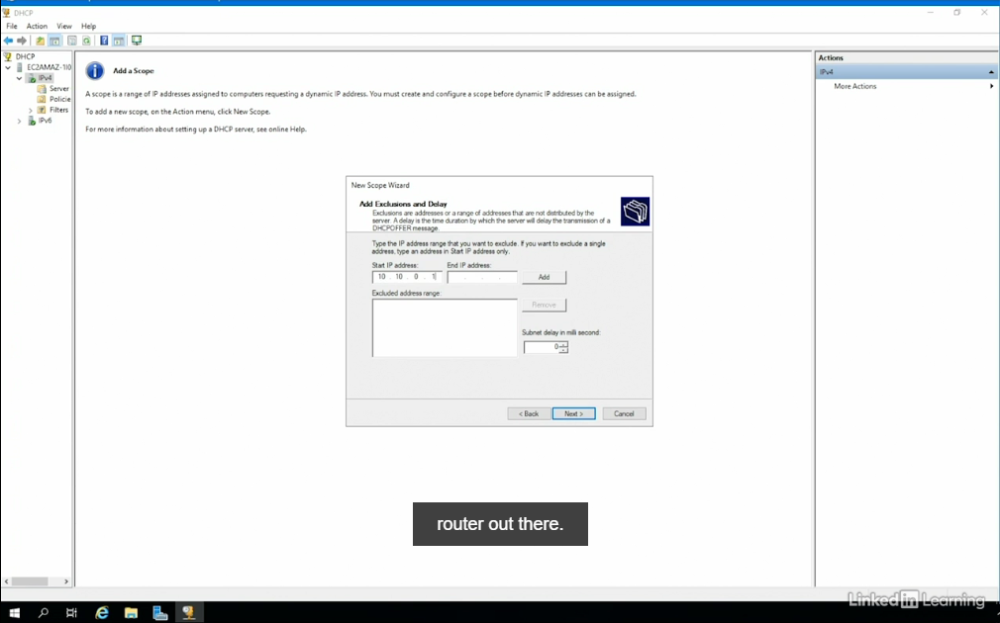

# Networking Foundations: IP Addressing

### IP Addressing Basics

IP Addresses define:
* Network Location
* Host Identification Number

Expressing IP addresses
Dotted decimal - 32 bit address viewed by computers in binary; 8 bits in each sections (octets).

Shortcuts for IPv6 Addresses

Substitute consecutive fields that have zeroes with `::`

Trim leading zeroes from any field

e.g. `2001:0db8:85a3:0000:0000:8a2e:0370:7334`
becomes `2001:db8:85a3::8a2e:370:7334` in shortened form.

IP Addressing structures
**Subnet Mask**: indicates the host portion of the IP address

The 0 in `255.255.255.0` is the host portion of the IP `192.178.0.110`. Therefore, `110` is the host.

**Default gateway**: Routes local router to destination IP Address

**DNS addresses**: resolves website name into routable IP address.

### IP Address Components

Classful methodology
1. **Class A**: 0.0.0.0 to 127.255.255.255
Class A is reserved for huge networks.

2. **Class B**: 128.0.0.0 to 191.255.255.255
Class B is reserved for medium-sized networks.

3. **Class C**: 192.0.0.0 to 223.255.255.255
Class C is for small-sized networks.

4. **Class D**: 224.0.0.0 to 239.255.255.255
Class D is reserved for multi-casting.

**Multicasting**: sending data to a group of receivers addressed in a multicast range.

5. **Class E**: 240.0.0.0 to 255.255.255.254

**Subnet Masks**
These are the tool that permits the identification of the network ID portion of the IP Address versus the host ID portion.

In IPv4 Environments, subnet masks are:
* forward slash and number of bits; called "prefix notation".
- a class A network has subnet mask of /8 (255.0.0.0)
- a class B network has subnet mask of /16 (255.255.0.0)
- a class C network has subnect mask of /32 (255.255.255.0)

**Subnet Addressing**
Creating network: 2^n
Creating hosts: 2^n - 2

Where n is the bits you steal from the subnet mask.

In business networks, they use 10.0.0.0 (255.255.255.0)

**Variable-length subnet masking**: take an unusued subnet and create more netowkrs by creating more subnets.

**Broadcast addressing**
Set all the host bits to 1 in order to broadcast.

e.g. 10.192.255.255

The -2 eliminates the reserved cases when bits are a 1, for broadcast addressing.

**IPv6 Addresses**
- 128 bits in length
- represented with hexadecimals
- default mask is 64 bits

### Exercise for Subnet Masks and Addressing
1. What is the default subnet mask for Class B address space?

A: In class B, it's 16 bits; therefore, it's 255.255.0.0

2. What is the dotted decimal notation of the subnet mask? `172.16.1.0/20`

A: 8 bits + 8 bits + 4 bits = 20 bits; Since there is 32 bits in the address and 20 bits is taken, leaving 12 bits behind then the dotted decimal notation is 255.255.240.0

3. What is the default subnet mask used in IPv6 addressing?

A: /64 by default.

4. What two parts of the IP address does the subnet mask delineate?

A: Network ID and the Host ID.

### CIDR and Aggregation

Early IP Address problems:
1. Public IP Addresses were in short supply
2. The 32-bit address started looking inadequate
3. Routing table size was growing

CIDR: Classless Inter-domain routing
CIDR was brought to deal with the IP address issue and the size of internet routing problem.

IPv6 proposed to fix the 32-bit issue.

CIDR marked the end of classful system of IP addresses and **conceptualized prefix notation**.

### Exercise for IP Address Route Aggregation

1. 10.10.67.0/24 -> 10.10.67.0/20 (8+8+4)
2. 10.10.68.0/24 -> 10.10.68.0/20
3. 10.10.69.0/24 -> 10.10.69.0/20
4. 10.10.70.0/24 -> 10.10.70.0/20
5. 10.10.71.0/24 -> 10.10.71.0/20
6. 10.10.72.0/24 -> 10.10.72.0/20

Why `/20`? Finding the similarity in the octets of the 6 addresses, we find differences on the third octet (67, 68, 69, 70, 71, 72).

Converting those decimal values to binary and finding the similarities in the bits will leave you 4 bits of similiar bits. Hence, 8bits (1st octet) + 8bits (2nd octet) + 4bits (common bits on the third octet) = 20bits.

### Some IP Services

DHCP - has few methods:
1. Client: DHCP DISCOVER
2. Server: DHCP OFFER

Leases. Leases has duration; Client can attempt to renew lease; Server can allow leases to expire, and Server pulls address from DHCP pool.

By default, DHCP automatically assigns IP address to client. However, a client can choose to manually setup their IPv4 and IPv6 addresses.

A server admin can also add a scope of IP address in their DHCP server.

DNS - Domain Name Systems; They map the numerical IP address to an easy-to-remember name.

DNS Servers are located all over the world. Stored records are defined in a DNS zone.

Cloud services like AWS provide DNS servers, like the Route 53.

**RFC 1918 Addressing** and **NAT**
- important keys for resolving the IPv4 shortage.

Originally, the Network Address Translation (NAT) was a temporary bandage for the IPv4 address shortage.

**RFC 1918**. Request for comments document numbered 1918 specified this idea.

### Definition of Terms
1. **Request** - sent by the client in response to an offer
2. **Discover** - sent by the client to locate a DHCP server
3. **Lease** - the amount of time a client can possess the IP address info
4. **Pool** - used to configure DHCP in the network
5. **Offer** - sent by the DHCP server
6. **Zone** - A container for the DNS records
7. **MX** - a mail server record
8. **AAAA** - an IPv6 host record
9. **CNAME** - an alias record

### RFC 1918 private IP address ranges
* Class A: 10.0.0.0 - 10.255.255.255
* Class B: 172.16.0.0 - 172.31.255.255
* Class C: 192.168.0.0 - 192.168.255.255